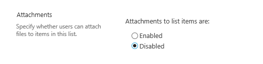
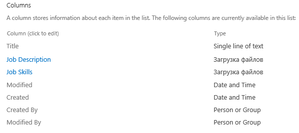
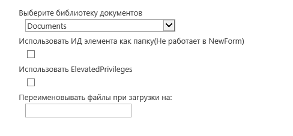
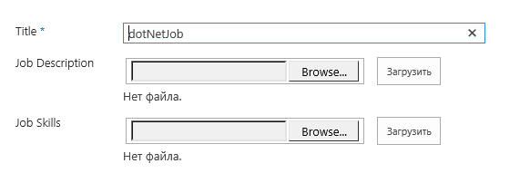
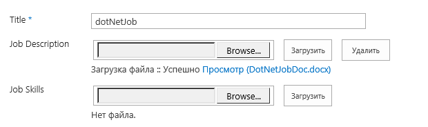
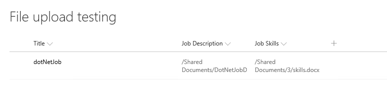

# Introduction 
Custom Sharepoint single file upload field

# Support
Sharepoint 2013/2019 on-premis

# Demo

##Рекумендую отключить стандартные вложения в списке

##В настройках списка появится новый тип поля "Загрузка файлов"

##Настройки поля

- Выберите библиотеку документов
>Библиотека куда будут загружаться файлы
- Использовать ИД элемента как папку(Не работает в NewForm)
>По умолчанию файлы будут загружаться в корень библиотеки, если включить данную настройку то автоматически будет создана папка с ID текущего элемента
- Использовать ElevatedPrivileges
>Вариант когда доступ к библиотеки отсутсвует и подразумевается редактирование файлов только через данный список
- Переименовывать файлы при загрузки на
>Вариант когда необходимо чтобы все загружаемые файлы имели определенное название в библиотеке

##Представление в списке

##Представление формы

##Предсталвение в списке
